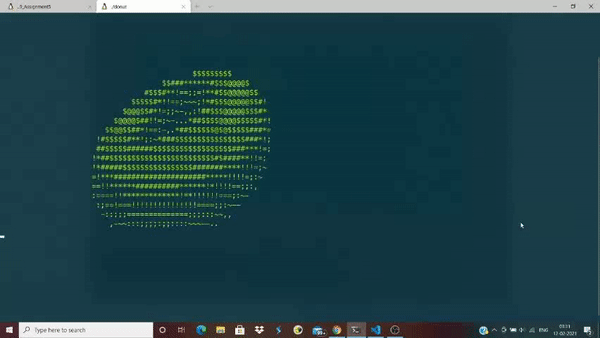
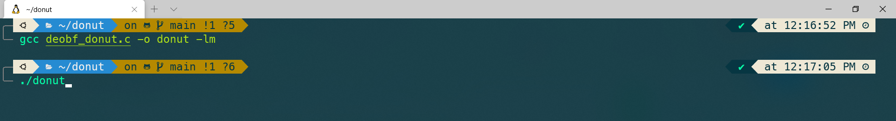
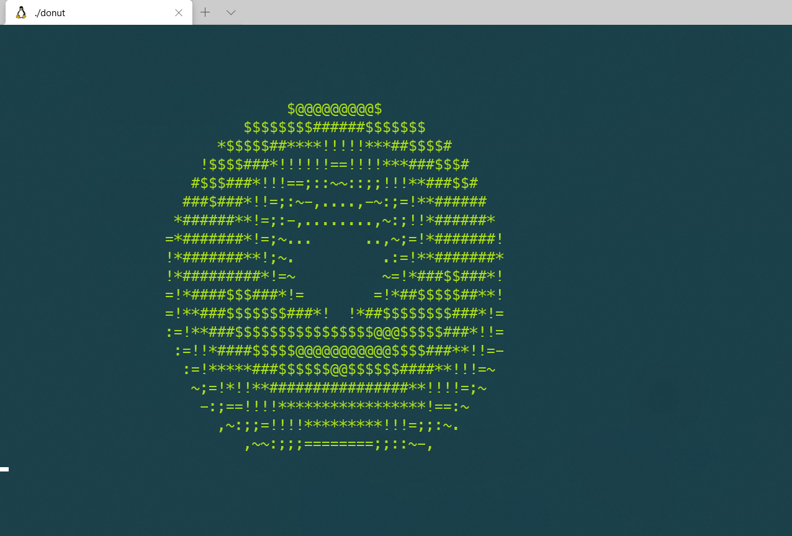

# DONUT
<div style="text-align: justify">
A <b>C-program</b> to create a <em>3-D illusion</em> of a <b>Donut</b> that is rotating
<br/><br/>

To know more about how the code works an what is the logic involved
in designing such a beautiful program refer to the article given below
<div>
<br/>

Source: [Donut math: how donut.c works](https://www.a1k0n.net/2011/07/20/donut-math.html)

## How to Run

<div style="text-align: justify">

There are two files included in this project 

1. obf_donut.c: Obfuscation Code 
2. deobf_donut.c: De-Obfuscation Code (Readable Version)

If You have MAKE installed then do the following

```shell
$ make
$ make run # to run obf_donut.c

# Yup thats it, it is that simple

$ make run2 # to run deobf_donut.c
```

If you don't have make installed, not a big issue

Just compile using GCC

```shell
$ gcc obf_donut.c -o donut -lm
$ ./donut

# now enjoy the rotating donut :)
```

</div>


## NOTE:
1. This code makes use of escape sequences particularly identified by the linux kernels. So works fine on Ubuntu, LinuxMint. But you won't/might not see the effect on powershell (Windows)
&nbsp;
2. Windows users can make use of WSL or Cygwin to get the effect.
&nbsp;
3. Finally ignore all warnings (Ignorance is Bliss &#128541;).

## Demo



## Screen Shots

#### Running the code


#### Output

